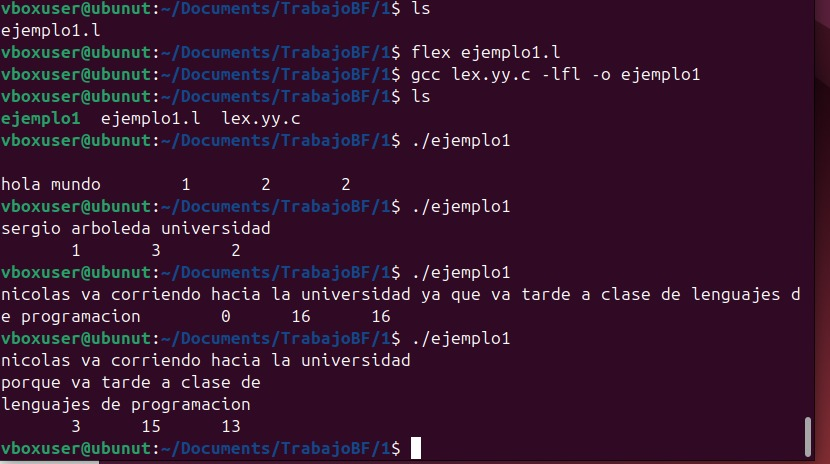
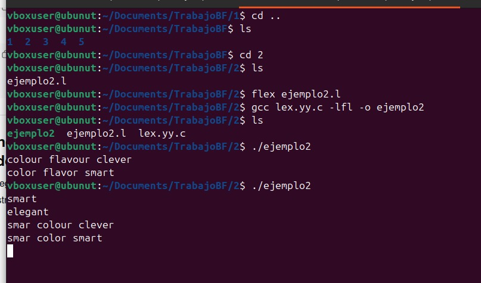
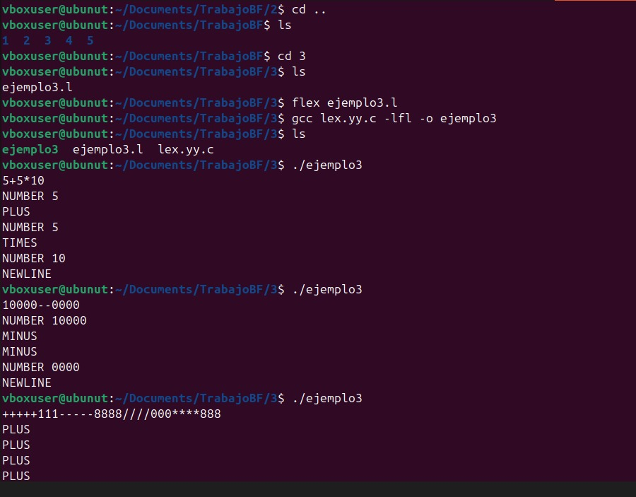
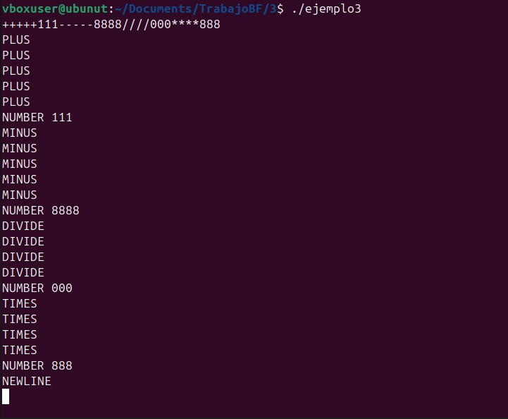
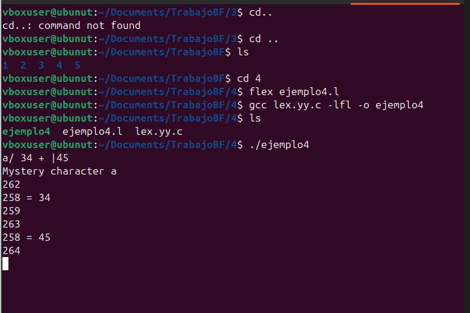
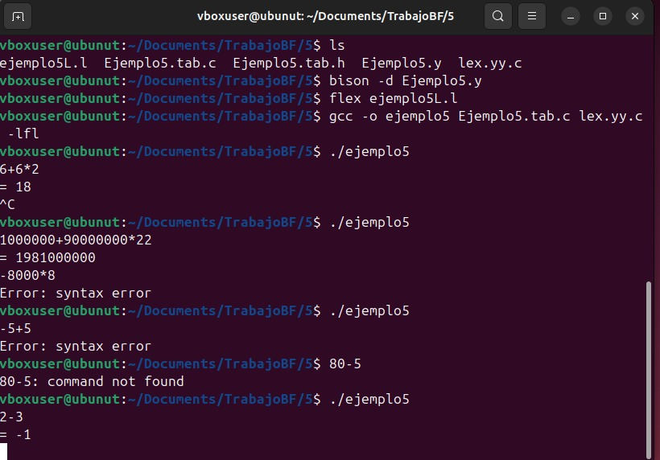
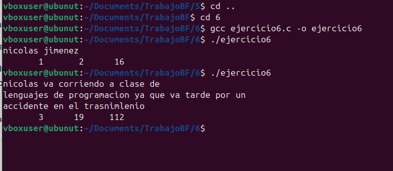

# FLEX-Y-BISON

**INTRODUCCION**

El análisis léxico y sintáctico es una parte fundamental en el desarrollo de compiladores e intérpretes, ya que permite reconocer y procesar correctamente la estructura de un lenguaje. Las herramientas Flex y Bison facilitan este proceso mediante la generación automática de analizadores léxicos y parsers a partir de reglas y gramáticas definidas por el programador.

En este trabajo se desarrollaron y ejecutaron los ejemplos propuestos en el capítulo 1 del libro *Flex & Bison*, utilizando  Ubuntu y la terminal Linux para la compilación de los programas. A través de estos ejemplos se exploró el reconocimiento de patrones, la creación de tokens, y la construcción de una calculadora básica que demuestra la integración entre Flex y Bison.

Adicionalmente, se resolvieron los ejercicios planteados en el capítulo, incluyendo la implementación manual de un programa en lenguaje C para el conteo de palabras, con el objetivo de comparar la complejidad y eficiencia entre una solución desarrollada con Flex y otra escrita directamente en C.

**INSTALACION**

Las herramientas necesarias para trabajar con analizadores léxicos y sintácticos fueron **Flex**, **Bison** y el compilador **GCC**.

**COMANDO**

sudo apt install flex bison gcc

flex --version

bison --version

gcc --version

**COMO EJECUTARLO**

1.gcc lex.yy.c -lfl -o (Nombre del programa)

2.  ./programa

flex genera el archivo lex.yy.c

bision -d genera archivo.tab.c

gcc compila los arhivos y crea el ejecutable

**EJECUCION DE LOS 5 EJEMPLOS DEL LIBRO**

Este ejemplo permite contar líneas, palabras y caracteres a partir de reglas definidas mediante expresiones regulares. El resultado mostrado corresponde al número total de coincidencias encontradas durante el análisis del texto ingresado. Se evidencia cómo Flex puede procesar cadenas de entrada de forma automática y eficiente sin necesidad de implementar manualmente el análisis carácter por carácter.

Ejemplo 1:

Este ejemplo permite contar líneas, palabras y caracteres a partir de reglas definidas mediante expresiones regulares. El resultado mostrado corresponde al número total de coincidencias encontradas durante el análisis del texto ingresado. Se evidencia cómo Flex puede procesar cadenas de entrada de forma automática y eficiente sin necesidad de implementar manualmente el análisis carácter por carácter.

Ejemplo 2:

En este ejemplo se realiza una sustitución directa de palabras específicas mediante patrones definidos en Flex. Al ingresar palabras como *colour* o *flavour*, el programa imprime su equivalente en inglés americano. El resultado demuestra cómo Flex puede utilizarse para transformar texto de manera sencilla, reemplazando únicamente los patrones definidos y dejando intacto el resto del contenido.

Ejemplo 3:

El programa reconoce operadores aritméticos y números, mostrando mensajes que indican qué token fue detectado. El resultado obtenido al ejecutar expresiones como `2+3*4` muestra cada símbolo identificado por separado, evidenciando el proceso de análisis léxico antes de realizar cualquier cálculo.

Ejemplo 4:

Este ejemplo amplía el anterior al asignar valores numéricos a cada token y mostrarlos en pantalla. Los resultados permiten observar cómo Flex no solo reconoce patrones, sino que también puede devolver códigos específicos que posteriormente serán utilizados por un parser. La aparición de mensajes como *Mystery character* confirma el manejo de caracteres no definidos dentro del scanner.

Ejemplo 5:

En este caso se integra Flex con Bison para crear una calculadora funcional capaz de evaluar expresiones matemáticas respetando la precedencia de operadores. Los resultados obtenidos, como `= 18` al ingresar `6+6*2`, demuestran el funcionamiento del análisis sintáctico y la correcta interpretación de la gramática definida.

**SOLUCION PREGUNTAS CAPITULO 1**

PREGUNTA 1:

La calculadora no acepta una línea que contenga solo un comentario si el parser no define reglas para líneas vacías. Esto ocurre porque el parser espera recibir tokens válidos y un comentario puede ser ignorado completamente por el scanner. La solución más sencilla sería manejar los comentarios en el scanner (Flex), permitiendo que estos se ignoren sin afectar la estructura sintáctica.

PREGUNTA 2:

Para permitir números hexadecimales se debe agregar un nuevo patrón en el scanner, por ejemplo:

0[xX][0-9a-fA-F]+

Luego, el valor puede convertirse usando la función `strtol`, almacenándolo en `yylval` antes de retornar el token NUMBER. Esto permite que la calculadora reconozca tanto números decimales como hexadecimales.

PREGUNTA 3:

Agregar operadores AND y OR puede generar conflictos si se utiliza el símbolo `|`, ya que en la gramática actual este representa el operador ABS. Si se usa también como OR binario, el parser puede volverse ambiguo y producir conflictos shift/reduce. Por esta razón es recomendable definir un token diferente o modificar la gramática para evitar ambigüedad.

PREGUNTA 4:

El scanner escrito manualmente no reconoce exactamente los mismos tokens que la versión generada con Flex. Flex utiliza expresiones regulares más robustas y maneja automáticamente múltiples coincidencias, mientras que el scanner manual depende de condiciones programadas directamente en C, lo que puede limitar su precisión.

PREGUNTA 5:

Flex no es la mejor opción para lenguajes donde el análisis léxico depende fuertemente del contexto, como aquellos con indentación significativa o reglas complejas que no pueden describirse fácilmente con expresiones regulares. En estos casos, un scanner manual puede ofrecer mayor control sobre el análisis.

PREGUNTA 6:

Se implementó una versión del programa Word Count directamente en C sin utilizar Flex. Aunque el resultado fue correcto, el código resultó más largo y menos flexible que la versión con Flex. Esto demuestra que Flex simplifica la creación de analizadores léxicos, facilitando el mantenimiento y la lectura del código.

**CONCLUSION**

El desarrollo de los ejemplos del capítulo 1 permitió comprender el funcionamiento básico de las herramientas Flex y Bison para la construcción de analizadores léxicos y sintácticos. A través de la ejecución de cada programa se evidenció cómo Flex facilita el reconocimiento de patrones mediante expresiones regulares, mientras que Bison permite definir la estructura gramatical necesaria para interpretar correctamente las expresiones.

Durante el proceso se observó que el uso de Flex reduce significativamente la complejidad del código en comparación con una implementación manual en lenguaje C, haciendo que el desarrollo sea más claro y fácil de mantener. La integración entre ambas herramientas permitió crear una calculadora funcional que respeta la precedencia de operadores, demostrando la importancia del análisis sintáctico.

Finalmente, la comparación entre la versión automática y la implementación manual del conteo de palabras permitió concluir que, aunque el código en C ofrece mayor control, Flex resulta más práctico y eficiente para desarrollar analizadores en proyectos reales.

